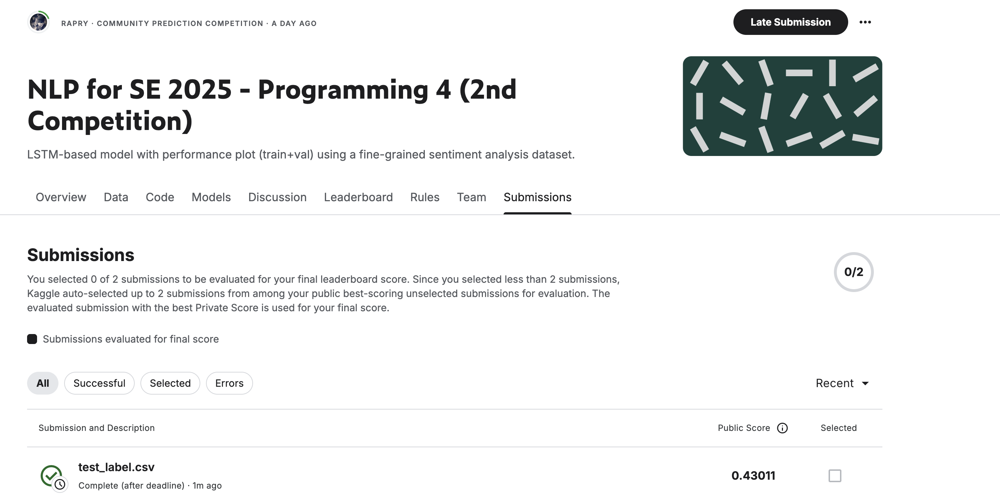

# NLP Programming Assignment 4 using LSTM

## Setup

### Install the required packages

```bash
pip install -r requirements.txt
```
1. Use `main.ipynb` to train the model
2. Use `predict.ipynb` to predict the test data

Best model was already saved in `models` folder. You can use it to predict the test data.

## Result (42.18% accuracy)

